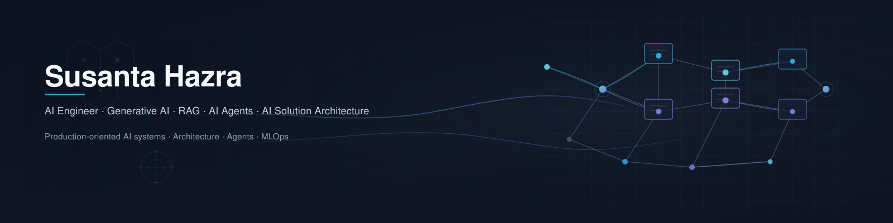

  

# Hi, I'm Susanta Hazra 👋

### AI Engineer | LLMs • RAG • AI Agents | AI Solution Architecture | Full-Stack AI Systems

I design and build production-oriented AI systems combining LLMs, Retrieval-Augmented Generation, agentic workflows, APIs, and modern web interfaces.

My focus is modular architecture: maintainable services, clear provider boundaries, and deployable applications that solve real business problems—from backend APIs and inference layers to full-stack AI products.

---

# 🚀 Featured Projects

## Enterprise Communication Intelligence

**Enterprise Communication Intelligence Platform**

[Repository](https://github.com/Susanta2025-lab/enterprise-communication-intelligence)

Provider-independent enterprise AI platform for transforming business communications into structured intelligence, built with Clean Architecture, FastAPI, dependency injection, automated testing, and a multi-cloud provider abstraction designed for Azure AI Foundry and Amazon Bedrock.

### Highlights

- Clean Architecture with a provider-independent AI layer
- Configuration-driven provider factory and dependency injection
- Versioned REST API (`POST /api/v1/communications/analyze`)
- Structured logging, exception hierarchy, and health/readiness endpoints
- Automated tests, ADRs, and Mermaid architecture diagrams
- Next: Azure AI Foundry and Amazon Bedrock integrations

**Tech:** Python • FastAPI • Pydantic • Pytest • Ruff • Clean Architecture • Azure AI Foundry (planned) • Amazon Bedrock (planned)

---

## Estudio PolyMind — Multi-LLM RAG & Agent Orchestration

[Repository](https://github.com/Susanta2025-lab/estudio-polymind-llm-orchestration)

Local multi-LLM RAG and agent orchestration platform demonstrating semantic routing, hybrid retrieval, reranking, conversational memory, tool use, FastAPI services, Docker, and CI.

### Highlights

- Multi-LLM orchestration (Ollama, Mistral, Qwen, Gemma, Phi)
- LangGraph workflows with tool calling and session memory
- Hybrid dense + BM25 retrieval with Reciprocal Rank Fusion
- Cross-encoder reranking and semantic routing
- ChromaDB vector search, Streamlit UI, evaluation/benchmarking
- Dockerized services with GitHub Actions CI

**Tech:** Python • FastAPI • LangGraph • ChromaDB • Ollama • Streamlit • Docker • GitHub Actions

---

## FatoCheck — Fake News Detection API

Deployed NLP classification system using a tuned **TF-IDF + XGBoost** pipeline, with local fine-tuned **BERT** inference, a FastAPI backend, Streamlit frontend, Docker, and automated CI.

  
  
  
  
  
  
  

**[Live Demo](https://fatocheck-ai.streamlit.app/)** · **[Live API](https://fatocheck.onrender.com/docs)** · **[Repository](https://github.com/Susanta2025-lab/Fatocheck)**

**Highlights**

* Tuned TF-IDF + XGBoost pipeline achieving approximately **97.08% test accuracy**
* Public FastAPI deployment using **XGBoost as the production inference model**
* Fine-tuned `bert-base-uncased` supported and verified for **local inference**
* Streamlit frontend communicating with the FastAPI backend over HTTP
* Dockerized backend with GitHub Actions CI and health/readiness endpoints

**Tech:** Python · FastAPI · Scikit-learn · XGBoost · Transformers · Streamlit · Docker · Render

---

## MediChrono Insight — AI-Powered Medical Chronology Platform

[Repository](https://github.com/Susanta2025-lab/medichrono-insight) · [Live Demo](https://medichrono-insight.vercel.app/)

Live full-stack AI portfolio application, evolved from a SWANS Applied AI Hackathon prototype, for interactive medical chronology visualization and AI-assisted case summarization.

### Highlights

- React/TypeScript frontend with interactive medical timeline
- Client-side Excel chronology upload and workbook parsing
- Search, filtering, event inspector, and treatment history views
- FastAPI backend with OpenRouter + Google Gemini 2.5 Flash
- Live Vercel frontend and Render backend (legal-tech use case)
- Known limits: no automated tests or persistence yet; single-worksheet uploads; some mapping/grouping still incomplete

**Tech:** React • TypeScript • FastAPI • OpenRouter • Gemini • Vercel • Render

---

## Selected Collaboration

### Grid Intelligence — Energy Price Forecasting

[Repository](https://github.com/xucenying/grid-intelligence)

Collaborative ML/MLOps project for German electricity-price forecasting using statistical, tree-based, and deep-learning models with FastAPI, Docker, Streamlit, and GCP.

**Tech:** Prophet • ARIMA • XGBoost • LSTM • Transformer • FastAPI • Docker • Streamlit • GCP

---

# 🛠 Core Engineering Stack

| Area | Capabilities |
|------|----------------|
| **AI / GenAI** | LLMs, RAG, AI Agents, LangGraph, LangChain, OpenRouter, Ollama, Prompt Engineering, Tool Calling, Hybrid Retrieval, Reranking, Vector Search |
| **Backend / Architecture** | Python, FastAPI, REST APIs, Pydantic, Clean Architecture, Dependency Injection, Async APIs |
| **ML / NLP** | Scikit-learn, XGBoost, Transformers, BERT, PyTorch, Model Evaluation, Time-Series Forecasting |
| **Frontend** | React, TypeScript, Vite, Tailwind CSS, Streamlit |
| **Infrastructure / MLOps** | Docker, GitHub Actions, CI/CD, Render, Vercel, GCP · Azure AI Foundry (learning / planned) · Amazon Bedrock (planned) |

---

# 🎯 Current Engineering Focus

- AI Solution Architecture
- Enterprise LLM applications
- Retrieval-Augmented Generation
- Agentic workflows
- Provider-independent AI architectures
- Full-stack AI applications
- Cloud AI integration and MLOps

---

# 📫 Connect

- [LinkedIn](https://www.linkedin.com/in/susantahazra)
- [GitHub](https://github.com/Susanta2025-lab)
