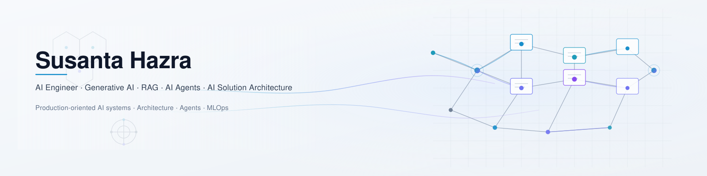

<picture>
  <source media="(prefers-color-scheme: dark)" srcset="./assets/github-profile-banner-dark.svg">
  <source media="(prefers-color-scheme: light)" srcset="./assets/github-profile-banner-light.svg">
  
</picture>

# Hi, I'm Susanta Hazra 👋

# AI Engineer | Generative AI | LLM Applications | AI Agents | Full-Stack AI Systems | MLOps

I design and build production-oriented AI applications that combine Large Language Models (LLMs), Retrieval-Augmented Generation (RAG), AI agents, modern APIs, and intuitive user interfaces.

My work focuses on transforming AI concepts into modular, maintainable, deployable systems that solve real-world business problems while applying the rigor developed through many years of scientific research.

---

## 🚀 About Me

- AI Engineer specializing in Generative AI, LLM applications, RAG, AI Agents, and MLOps
- Building production-oriented AI systems from architecture to deployment
- Passionate about scalable AI architectures, observability, maintainability, and real-world impact
- Currently focused on enterprise AI applications, intelligent automation, and agentic workflows

---

# 🚀 Featured Projects

---

## 🩺 MediChrono Insight — AI-Powered Medical Chronology Platform

**Repository**

https://github.com/Susanta2025-lab/medichrono-insight

**Live Demo**

https://medichrono-insight.vercel.app/

AI-powered medical chronology platform designed for legal professionals, insurance companies, and medical reviewers.

### Highlights

- AI-generated medical case summaries
- Interactive medical timeline visualization
- Advanced search and filtering
- Event inspection interface
- Expandable treatment history
- Modern React frontend
- FastAPI backend
- Production-ready architecture
- Live deployment

**Tech Stack**

React • TypeScript • Vite • Tailwind CSS • FastAPI • Python • OpenRouter • Gemini • Vercel

---

## 🧠 Estudio PolyMind — Multi-LLM RAG & Agent Orchestration Platform

**Repository**

https://github.com/Susanta2025-lab/estudio-polymind-llm-orchestration

Production-style AI platform demonstrating modern LLM orchestration and Retrieval-Augmented Generation.

### Highlights

- Multi-LLM orchestration
- LangGraph workflows
- Hybrid Retrieval
- Semantic routing
- Cross-encoder reranking
- Session memory
- Dockerized deployment
- GitHub Actions CI
- Modular architecture

**Tech Stack**

Python • FastAPI • LangGraph • ChromaDB • Ollama • Streamlit • Docker • GitHub Actions

---

## 🔍 Fatocheck — Fake News Detection API

**Repository**

https://github.com/Susanta2025-lab/Fatocheck

Production-ready fake news detection platform combining classical machine learning and Transformer models.

### Highlights

- XGBoost + TF-IDF pipeline
- Fine-tuned BERT model
- REST API
- Dockerized deployment
- Render deployment
- Production architecture

**Tech Stack**

Python • FastAPI • Scikit-Learn • XGBoost • Transformers • Docker • Render

---

## ⚡ Grid Intelligence — Energy Price Forecasting Platform

**Repository**

https://github.com/xucenying/grid-intelligence

Collaborative end-to-end energy forecasting platform for the German electricity market.

### Highlights

- Automated data pipelines
- Time-series forecasting
- Transformer models
- XGBoost spike prediction
- FastAPI backend
- Docker deployment
- Google Cloud integration

**Tech Stack**

Python • PyTorch • FastAPI • Docker • GCP • Streamlit

---

# 📂 Portfolio Overview

| Project | Focus | Technologies |
|----------|-------|--------------|
| MediChrono Insight | AI Medical Platform | React, FastAPI, LLMs |
| Estudio PolyMind | Multi-LLM RAG Platform | LangGraph, ChromaDB |
| Fatocheck | NLP Classification | BERT, XGBoost |
| Grid Intelligence | Time-Series Forecasting | PyTorch, FastAPI |

---

# 🤖 AI Engineering Expertise

### Generative AI

- Large Language Models (LLMs)
- Retrieval-Augmented Generation (RAG)
- AI Agents
- LangGraph
- LangChain
- Prompt Engineering
- Tool Calling
- Function Calling
- Semantic Routing
- Hybrid Retrieval
- Cross-Encoder Reranking
- Conversational Memory

---

### Machine Learning

- Supervised Learning
- NLP
- Transformer Models
- BERT
- XGBoost
- Scikit-Learn
- Time-Series Forecasting
- Model Evaluation

---

### Backend Development

- FastAPI
- REST APIs
- Python
- Pydantic
- Async Programming

---

### Frontend Development

- React
- TypeScript
- Vite
- Tailwind CSS
- Streamlit

---

### AI Infrastructure

- ChromaDB
- Vector Databases
- Docker
- GitHub Actions
- CI/CD
- Render
- Vercel
- Google Cloud
- Azure AI Services

---

### Programming Languages

- Python
- TypeScript
- JavaScript
- SQL
- Bash

---

# 🌍 Professional Background

Before transitioning into AI Engineering, I spent over a decade conducting scientific research in computational and experimental chemistry.

That experience strengthened my ability to:

- solve complex analytical problems
- design reproducible workflows
- evaluate evidence critically
- build reliable systems
- communicate technical concepts effectively

These principles continue to guide my approach to AI system design.

---

# 🎯 Current Focus

Currently building production-oriented AI systems involving:

- AI Agents
- Enterprise LLM Applications
- Retrieval-Augmented Generation (RAG)
- Multi-Agent Workflows
- Intelligent Document Processing
- AI-powered Decision Support
- Production API Development
- Full-Stack AI Applications
- Cloud Deployment
- MLOps

---

# 📫 Connect With Me

- LinkedIn: https://www.linkedin.com/in/susantahazra
- GitHub: https://github.com/Susanta2025-lab

---

*"Building practical AI systems that bridge research, engineering, and real-world deployment."*
